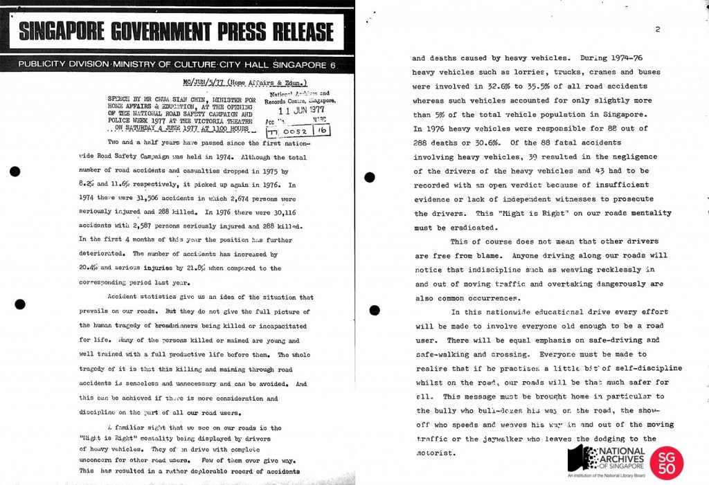

<iframe id="pxcelframe" src="//t.sharethis.com/a/t_.htm?ver=0.345.16985&amp;cid=c010#rnd=1577953888611&amp;cid=c010&amp;dmn=www.nas.gov.sg&amp;tt=t.dhj&amp;dhjLcy=62&amp;lbl=pxcel&amp;flbl=pxcel&amp;ll=d&amp;ver=0.345.16985&amp;ell=d&amp;cck=__stid&amp;pn=%2Fblogs%2Farchivistpick%2Froad-safety-campaign%2F&amp;qs=na&amp;rdn=www.nas.gov.sg&amp;rpn=%2Fblogs%2Farchivistpick%2F2015%2F06%2F&amp;rqs=na&amp;cc=SG&amp;cont=AS&amp;ipaddr=" style="display: none;"></iframe>

# SPEECH BY MR CHUA SIAN CHIN AT THE OPENING OF THE NATIONAL ROAD SAFETY CAMPAIGN, 1977

​																	National Archives of Singapore

A nationwide road safety campaign, *Road Safety for You*, was launched by then Minister for Home Affairs and Education, Mr Chua Sian Chin on 4 June 1977 at the Victoria Theatre.  A series of games and contests to teach road safety to students were held in May before the official opening of the campaign.

Since the launch of the annual road safety campaign in 1974, the number of injuries and fatalities caused by traffic accidents remained high. From 1974-1976, a total of 862 people died and 7,699 were injured in road accidents which authorities attributed to inconsiderate and reckless motorists, and jaywalking pedestrians. Therefore, unlike the previous campaign where the focus was on motorists and safe driving, the new campaign placed equal emphasis on safe driving and safe walking.

From the start of the campaign in June to the end of August 1977, national servicemen and police officers manned selected crossings to orientate pedestrians and motorists on the new jaywalking law which came into effect on 1 July 1977. Under the law, pedestrians were liable to be fined up to $50 if they fail to use designated crossings such as overhead bridges, underpasses, and zebra crossings.

A travelling road safety exhibition, safe driving rallies at the National Stadium car park, a four-week contest to spot safe and courteous drivers, and a TV forum organised by Radio and Television Singapore (RTS) were also held as part of the campaign.

In the eight months following the campaign, the number of road accidents involving death or injury decreased to 5,535, in comparison to the 6,294 incidents which occurred in the eight months before the campaign.

Despite the increase in population and road users, the number of fatal road accidents in Singapore in 2014 remained low at 149, compared to the 288 road deaths reported in 1976.

To read the full speech and view other records, click [here](http://www.nas.gov.sg/archivesonline/speeches/record-details/70801f7c-115d-11e3-83d5-0050568939ad).