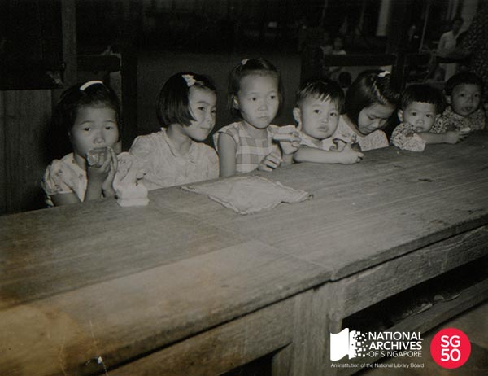

<iframe id="pxcelframe" src="//t.sharethis.com/a/t_.htm?ver=0.345.16985&amp;cid=c010#rnd=1577953814390&amp;cid=c010&amp;dmn=www.nas.gov.sg&amp;tt=t.dhj&amp;dhjLcy=67&amp;lbl=pxcel&amp;flbl=pxcel&amp;ll=d&amp;ver=0.345.16985&amp;ell=d&amp;cck=__stid&amp;pn=%2Fblogs%2Farchivistpick%2Fchildren-social-centre%2F&amp;qs=na&amp;rdn=www.nas.gov.sg&amp;rpn=%2Fblogs%2Farchivistpick%2F2015%2F06%2F&amp;rqs=na&amp;cc=SG&amp;cont=AS&amp;ipaddr=" style="display: none;"></iframe>

# CHRISTMAS PARTY AT A CHILDREN SOCIAL CENTRE, 1950

​						Ministry of Information and The Arts Collection, National Archives of Singapore

The first Children Feeding Centre was opened on 7 January 1947 at Havelock Road by Lady Dorothy Gimson, wife of the Governor of Singapore. By the end of 1947, 23 feeding centres were in operation and had served approximately 810,000 meals to 40,000 children, at an average of 4,000 meals a day. These meals offered by the Social Welfare Department were prepared according to the guidelines given by the Nutrition Unit of the College of Medicine. It was based on a special diet of rice, sardines, corned beef, vegetables and eggs, and supplemented by milk and fresh fruits.

The feeding centre targeted children from ages two to six years old to help those suffering from malnutrition at the time.

Lady Gimson, who took a special interest in the child feeding scheme, established a core group of volunteers to assist with the running of the centres. Most of the volunteers were made up of spouses of British officials and local elites, as well as members of local associations such as the Singapore Women Federation and Singapore Chinese Women Association. By November 1948, there were over two hundred volunteers which grew from the original four.

The feeding centres became a place which not only fed children but also provided them with basic education and practical skills such as book binding, knitting and stitching. To reflect this change, the feeding centres were phased out to be replaced by Children Social Centres in 1948.  These centres catered to children up to the age of 14 who did not have the opportunity to attend school.  They were in turn phased out by 1974 as more parents sent their children to kindergartens and schools.

To view more details of this image and other records, click [here](http://www.nas.gov.sg/archivesonline/photographs/record-details/b1022da2-1161-11e3-83d5-0050568939ad).