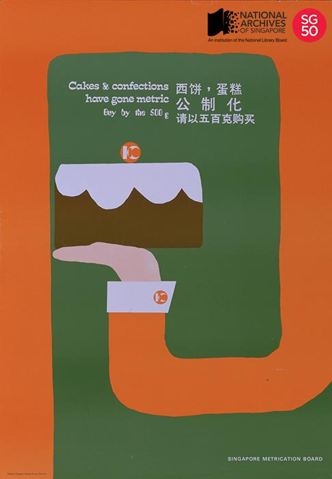

<iframe id="pxcelframe" src="//t.sharethis.com/a/t_.htm?ver=0.345.16984&amp;cid=c010#rnd=1577950087655&amp;cid=c010&amp;dmn=www.nas.gov.sg&amp;tt=t.dhj&amp;dhjLcy=58&amp;lbl=pxcel&amp;flbl=pxcel&amp;ll=d&amp;ver=0.345.16984&amp;ell=d&amp;cck=__stid&amp;pn=%2Fblogs%2Farchivistpick%2Fmetrication-in-singapore%2F&amp;qs=na&amp;rdn=www.nas.gov.sg&amp;rpn=%2Fblogs%2Farchivistpick%2F&amp;rqs=na&amp;cc=SG&amp;cont=AS&amp;ipaddr=" style="display: none;"></iframe>

# METRICATION IN SINGAPORE POSTER, 1970s

​                               Singapore Metrication Board Collection, National Archives of Singapore

The metric system or the International System of Units (SI) was introduced in Singapore with the passing of the Metrication Bill and, the Weights and Measures (Amendment) Bill. Both were passed on 31 December 1970 and came into effect on 15 February 1971. Old imperial units such as yard, foot and inch and local customary units like ‘kati’ and ‘tahil’ were gradually phased out and replaced by metric units over the next decade.

The Metrication Board was established on 13 December 1970 and chaired by industrialist, Dr [Baey Lian Peck](http://www.nas.gov.sg/archivesonline/photographs/record-details/a29caed8-1162-11e3-83d5-0050568939ad). The board’s main role was to ensure the successful implementation of the metric system in Singapore. It embarked on a 10-year plan which first focused on the public sector, then the private sector in particular: manufacturing, industrial and retail.

In order to bring awareness and educate the public on the new system, the board organised various activities and initiatives over the 10-year period which included: [travelling exhibitions](http://www.nas.gov.sg/archivesonline/posters/record-details/318beab1-115c-11e3-83d5-0050568939ad), radio and television programmes, [informative posters and pamphlets](http://www.nas.gov.sg/archivesonline/posters/record-details/32bdbc57-115c-11e3-83d5-0050568939ad), [contests](http://www.nas.gov.sg/archivesonline/posters/record-details/30b7f570-115c-11e3-83d5-0050568939ad), talks, periodicals and a zonal education programme for housewives. Dr Baey [shared in his oral history interview](http://www.nas.gov.sg/archivesonline/oral_history_interviews/record-details/7f462c2b-1161-11e3-83d5-0050568939ad?keywords=Singapore Metrication Board&keywords-type=all) that in order to reach out to the general public, a monthly newsletter Our Metric Way was distributed in each housing estate. The Metrication Digest which was a separate bi-monthly publication aimed at industries, was also distributed to factories.

By 1981, Singapore had largely converted to the metric system. The Metrication Board, which had achieved what it set out to do, was then dissolved and replaced by a smaller Weights and Measures Office to oversee enforcement.

To view more details of this image and other records, click [here](http://www.nas.gov.sg/archivesonline/posters/record-details/b6ff74cd-2ea4-11e4-859c-0050568939ad).